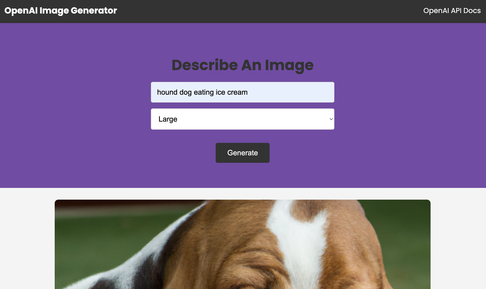

# OpenAI Image Generator

[Website](https://jweibelbootcamp.github.io/openAI-image-generator/)

## Table of Contents
- [Project Description](#description)
- [Installation Instructions](#installation)
- [Usage Instructions](#usage)
- [Contributing Resources](#contribution)
- [Testing Methods](#test)
- [GitHub User Name](#gitHub)
- [Email Address](#email)

## Project Description
Uses OpenAI (https://beta.openai.com) to generate an image based on user inputs.

## Installation Instructions
None necessary.

## Usage Instructions
Enter a plain text prompt within the 1000 character limit, then select the size of the image from the dropdown.

## Contributing Resources
Open AI, HTML, CSS, JavaScript, Bootstrap. 

## Testing Methods
None.

## GitHub User Name
jWeibelbootcamp

## Email Address
weibel.jason@gmail.com

## Licensing 
MIT
